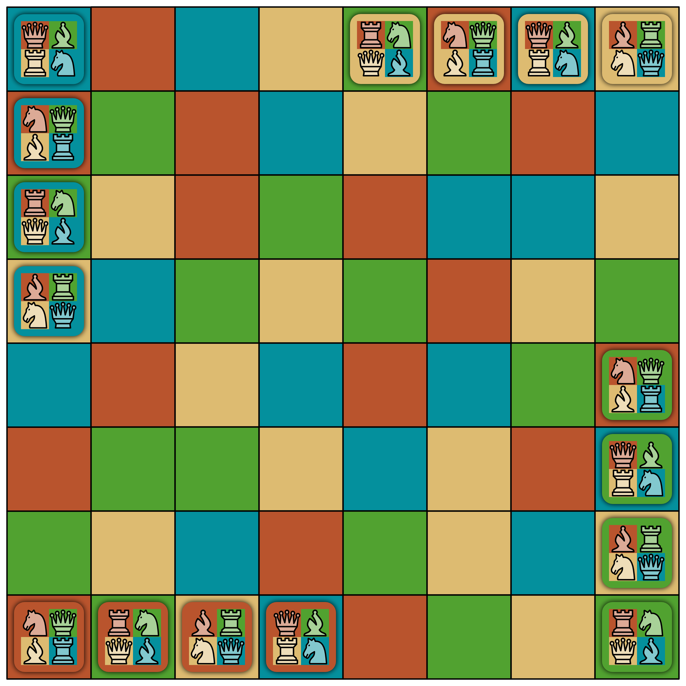

# Chamäleon Schach

## Entstehung

"Chamäleon Schach" ist ein schachähnliches Brettspiel, welches von Wolfgang Großkopf, dem Großvater des Autors, im Jahre 1982 entwickelt wurde. Die erste Version war damals komplett aus Holz gefertigt.

{width=70%}

Einen ersten Versuch das Spiel zu verlegen, hat es bereits zu DDR-Zeiten gegeben. Die Qualität der gefertigten Spiele in der DDR ist aber sehr schlecht gewesen. Daher haben viele Spieleautoren kaum Anstrengungen zur Veröffentlichung unternommen und eher Spiele für sich selbst im privaten Bereich entwickelt und gebaut. [vgl. @geithner2013]

Erst mit der Wende ist das Spiel im VSK Verlag in ordentlicher Qualtät erneut verlegt worden. Dabei hat es zwei Auflagen gegeben, eine 1990 und eine weitere 1992. 1991 belegte Chamäleon, wie das Spiel damals hieß, den siebten Platz im bekannten Ausscheid "Spiel des Jahres". [vgl. @grosskopf2019, s. 31]

Kurz vor dem Tod des Großvaters ist die Idee entstanden, das Brettspiel in digitaler Form neu aufzulegen. Der Enkel und Autor der Arbeit ist mit dieser Aufgabe betraut worden. Es existiert bereits eine Software-Bibliothek, welche die Spiellogik implementiert und ein erster App-Prototyp ist ebenfalls entstanden. Aus Vermarktungsgründen ist das Spiel nun umbenannt worden in "Chamäleon Schach", um die nahe Verwandtschaft zum traditionellen Schach zu verdeutlichen.

## Spielprinzip

Die ausführlichen Spielregeln finden sich im [Anhang](#spielregeln). An dieser Stelle werden lediglich die wichtigsten Kernaspekte des Spieles erläutert, welche für die algorithmische Lösung wichtig sind.

Gespielt wird auf einem speziellen Schachbrett mit 8x8 Feldern. Anders als beim klassischen Schach, haben die Felder aber vier unterschiedliche Farben (rot, grün, gelb und blau). Die Farben sind nach einem vorgegebenen Muster über das Brett verteilt.

{width=50%}

Die Spielfiguren sind sozusagen Chamäleons (also gestaltwandelnde Echsen). Denn je nach der Farbe des Feldes, auf dem sich eine Figur befindet, hat die Figur eine andere Schach-Rolle. Es kommen vier verschiedene Rollen vor: Springer, Königin, Läufer und Turm. Die Zuordnung von Feldfarbe zu Rolle ist je nach Figur unterschiedlich, ändert sich aber nicht im Verlaufe des Spieles.

{width=60%}

Jeder Spieler startet mit vier Figuren in einer festen Startaufstellung. Die Spieler ziehen nacheinander im Uhrzeigersinn und bewegen stets eine ihrer Figuren. Gegnerische Figuren können, wie beim richtigen Schach, geschlagen werden. Es besteht Zug-, aber kein Schlagzwang.

{width=60%}

Im Verlauf des Spieles schrumpft das Brett, um die Spieler zusätzlich unter Druck zu setzen. Die Brettgröße wird von den äußersten Figuren bestimmt. Wird durch das Bewegen einer Figur eine oder mehrere der äußeren Reihen frei, so schrumpft das Brett entsprechend.

{width=45%}

Ziel des Spieles ist es, alle gegnerischen Figuren zu schlagen und damit der einzige Überlebende zu sein.
