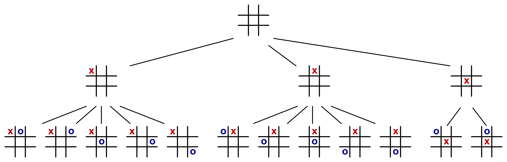
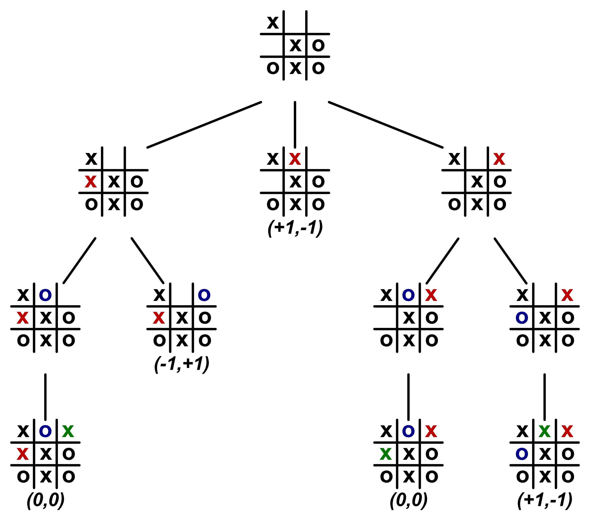
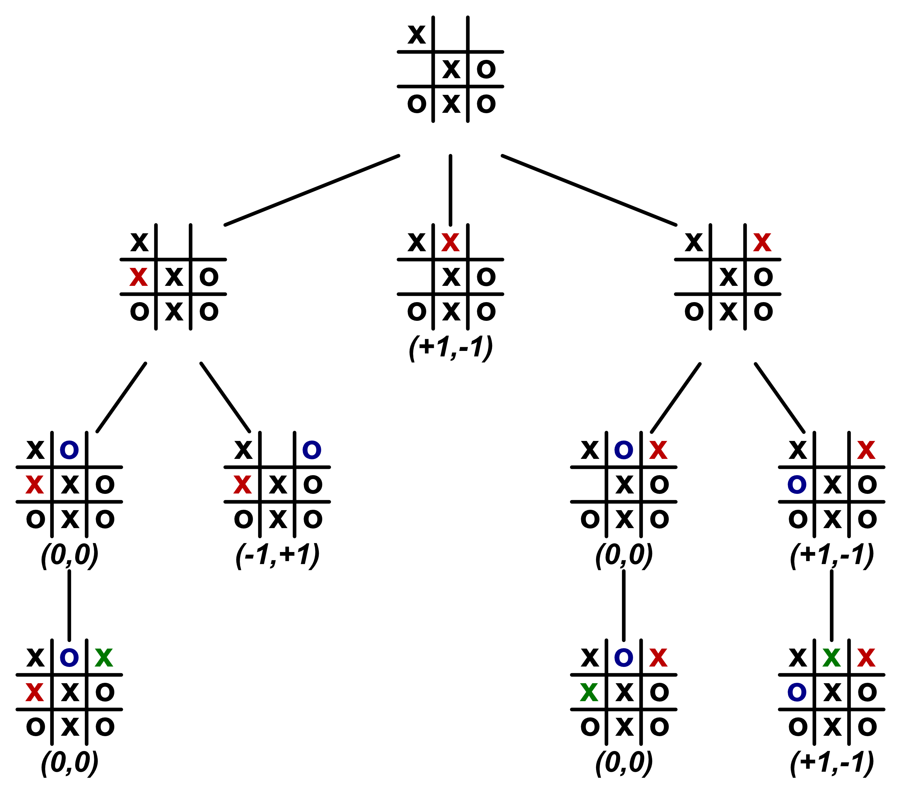
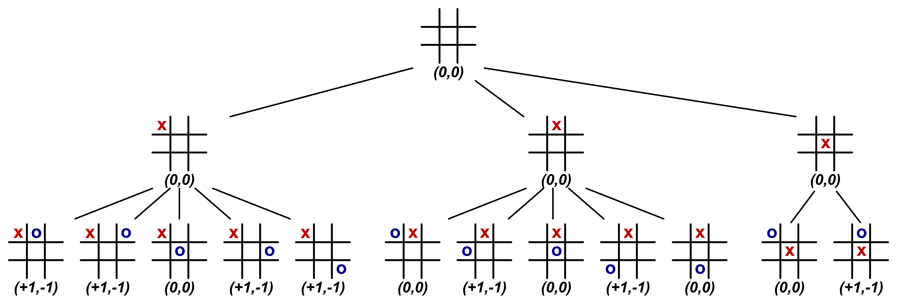

# Spieltheorie

Um einen intelligenten Computergegner zu programmieren, muss zuerst ermittelt werden, was überhaupt eine intelligente Spielweise ist. Dazu gibt es das mathematische Feld der Spieltheorie, die zur Analyse eben dieses Problems verwendet wird.

## Allgemein

Einen sehr guten Überblick und Einstieg in die Spieltheorie gibt Riechmann [-@riechmann2014].

Die Spieltheorie ist eine spezielle Form der Entscheidungstheorie. Der grundsätzliche Aufbau eines Entscheidungsproblems umfasst mehrere Komponenten:

- Es gibt einen Entscheider, der sich in einem bestimmten Umweltzustand (engl. state) befindet.
- Der Entscheider hat mindestens zwei verschiedene Handlungsalternativen (engl. actions), zwischen denen er vollkommen frei wählen kann.
- Mit der Entscheidung entsteht ein Handlungsergebnis (engl. result). Dieses Ergebnis wird typischerweise mit numerischen Werten beschrieben, welche eine Auszahlung (engl. utility/payout) für den Entscheider darstellt.
- Der Entscheider hat ein bestimmtes Ziel; in den meisten Fällen ist es die Maximierung seiner Auszahlung.

Die normative Entscheidungstheorie versucht nun die Entscheidungsfindung zu unterstützen. Es gilt also mit geeigneten Verfahren und Analysen herauszufinden, welche Entscheidung in welcher Situation getroffen werden sollte, um das bestmögliche Ergebnis für den Entscheider zu erzielen. [vgl. @riechmann2014, p. 1]

Spiele – vor allem Brettspiele – funktionieren grundsätzlich genauso:

- Jeder Spieler ist ein Entscheider, welcher durch die Spielregeln verschiedenen Spielsituationen (engl. game states) ausgesetzt wird.
- Die Spieler haben in den Situationen verschiedene mögliche Züge/Handlungen, zwischen denen sie wählen können. Je nach Spiel werden die Entscheidungen gleichzeitig oder nacheinander getroffen. Häufig führt auch eine getroffene Entscheidung in einen neuen Spielzustand, in dem wiederum eine Entscheidung zu treffen ist. Erst später wird dann ein Endzustand (engl. terminate state) erreicht, mit dem das Spiel endet.
- Das Ergebnis kann aus monetären Werten, Punkten oder simplen Ergebnisbeschreibungen (gewonnen, unentschieden, verloren) bestehen. Bei einigen Spielen erfolgen bereits während des Spielverlaufes Teilauszahlungen, bei anderen Spielen gibt es erst ganz am Ende nach einer langen Kette von Entscheidungen eine finale Auszahlung.
- Ziel eines jeden Spielers ist die Maximierung seines Endergebnisses.

Genauso wie die normative Entscheidungstheorie ist es auch das Ziel der Spieltheorie herauszufinden, wie sich ein Spieler entscheiden sollte, um das bestmögliche Ergebnis zu erzielen. Allerdings sind Spiele häufig wesentlich komplexer als normale Entscheidungsprobleme. Ebenso sind verschiedenste Methoden und Verfahren nötig, um unterschiedliche Arten von Spielen lösen zu können. All dies ist ebenfalls Teil der Spieltheorie.

Die formale Beschreibung erfolgt in dieser Arbeit wie folgt:

- $s$ bezeichnet einen konkreten Spielzustand und $S$ die Gesamtheit aller Spielzustände (engl. state space).
- $a$ bezeichnet eine mögliche Handlungsalternative und $A$ die Gesamtheit der möglichen Handlungen (engl. action space).
- die Auszahlung entsteht aus dem Paar des zugrundeliegenden Zustandes und der gewählten Aktion (engl. state-action pair) und wird als Funktion mit $\vec v(s,a)$ beschrieben. Das Ergebnis von $\vec v$ ist ein Vektor. Je eines der Elemente von $\vec v$ ist einem Spieler zugeordnet und beschreibt die Auszahlung für den jeweiligen Spieler. ($v$ ist abgeleitet vom engl. value)
- $\vec V$ beschreibt entsprechend die Gesamtheit aller Auszahlungen (engl. result space).

## Einordnung von "Chamäleon Schach"

Um herauszufinden, mit welchem Verfahren "Chamäleon Schach" zu analysieren ist, muss zunächst die Art des Spieles bestimmt werden:

"Chamäleon Schach" ist ein zugbasiertes Spiel. Das heißt, dass die Spieler ihre Züge nacheinander ausführen. Es gibt keine gleichzeitigen Entscheidungen. Ein Spieler ist an der Reihe, wählt aus den verschiedenen möglichen Zügen einen aus und führt diesen durch. Dadurch ändert sich der Spielzustand und der nächste Spieler ist an der Reihe. Die verfügbaren Handlungsalternativen für einen Spieler sind also direkt von den vorherigen Zügen abhängig. Man spricht von einem *sequentiellen Spiel*. [vgl. @riechmann2014, p. 47]

Formal bedeutet ein sequentielles Spiel, dass ein Folgezustand $s'$ direkt von dem vorherigen Zustand $s$ und der jeweiligen ausgeführten Aktion $a$ abhängig ist. Dadurch kann die Auszahlungsfunktion $\vec v(s,a)$ auch alternativ als $\vec v(s')$ definiert werden. Hierbei gilt stets: $\vec v(s,a) = \vec v(s')$. Beide Versionen sind gleichwertig und werden im Folgenden beliebig verwendet.

Mit einem Blick auf das Spielbrett können alle Informationen zum Spiel gewonnen werden. Es gibt keine Informationen, die nur einzelnen Spielern zugänglich sind (das wäre zum Beispiel der Fall, wenn Karten auf der Hand gehalten werden). Ebenso gibt es keine zufälligen Einflüsse (beispielsweise durch Würfel). Jeder Spieler hat zu jeder Zeit vollen Einblick auf das gesamte Spielgeschehen. Man spricht von einem *Spiel mit perfekter Information* (engl. perfect-information game). [vgl. @luce1957, pp. 58 - 59]

In "Chamäleon Schach" gibt es kein Geld, keine Punkte und keine Teilauszahlungen oder Zwischenergebnisse. Am Ende des Spieles gibt es lediglich **einen** klaren Gewinner, die restlichen Spieler haben verloren. Kooperationen zwischen den Spielern machen daher keinen Sinn. Ebenso ist klar, dass der Gewinn eines Spielers automatisch der Verlust der anderen bedeutet. "Chamäleon Schach" ist damit ein *strikt kompetitives Spiel* (engl. strictly competitive game). Solche Spiele werden auch als Nullsummenspiele (engl. zero-sum games) bzw. Spiele konstanter Summe (engl. constant-sum games) bezeichnet. [vgl. @luce1957, pp. 78, 164]

"Chamäleon Schach" kann zu zweit, zu dritt oder zu viert gespielt werden. Es handelt sich also um ein *Mehrspieler-Spiel* (engl. multiplayer game). [vgl. @luce1957, p. 161]

## Spielanalyse

Für jedes strikt kompetitive Spiel mit perfekter Information gibt es eine klar überlegene perfekte Spielweise. [vgl. @luce1957, p. 82, zitiert nach; @morgenstern1947]

### Spielbaum (engl. game tree)

Die Analyse und Lösung eines sequentiellen Spieles erfolgt über den Aufbau eines sog. *Spielbaumes* (engl. game tree). [vgl. @riechmann2014, p. 48]

In einem Spielbaum werden alle möglichen Spielverläufe in einer Baumstruktur dargestellt. Die Knoten des Baumes stellen die Spielzustände dar. Die Kanten symbolisieren die möglichen Handlungsalternativen des aktuellen Spielers. Mit einer Handlung/Zug gelangt man direkt von einem Spielzustand in den nächsten. Der Startzustand des Spieles bildet dabei die Wurzel des Baumes, von welchem sich alle weiteren Handlungen und Zustände ableiten. [vgl. @luce1957, p. 57]

Zum besseren Verständnis wird dieses Verfahren beispielhaft nun auf das Spiel TicTacToe angewandt. TicTacToe ist ebenfalls ein strikt kompetitives, sequentielles Spiel mit perfekter Information. Auf Grund der Einfachheit des Spieles eignet es sich sehr gut, um das Verfahren besser zu verstehen und nachvollziehen zu können.

Die Regeln sind sehr simpel: Auf einem Brett mit 3x3 Feldern platzieren nacheinander zwei Spieler ihr jeweiliges Zeichen auf ein noch freies Feld. Der eine Spieler ist Kreuz (x) und der andere ist Kreis (o). Wer zuerst drei seiner Symbole in einer Reihe, einer Spalte oder einer Diagonale gesetzt hat, gewinnt. Sollte dies nach neun Zügen noch keinem der Spieler gelungen sein, dann endet das Spiel mit einem Unentschieden, da kein freies Feld mehr übrig ist. [vgl. @abu2019]

Die Abbildung \ref{tttstart} zeigt den Spielbaum für TicTacToe für die ersten zwei Züge. Der Startzustand ist das leere Brett. Der erste Spieler (Kreuz) hat nun drei verschiedene Züge zur Auswahl. Theoretisch sind es neun Züge. Da das Spielbrett aber beliebig gedreht und gespiegelt werden kann, lassen sich die Möglichkeiten auf drei zusammenfassen.

Je nach Wahl von Spieler Kreuz entsteht nun eine andere Spielsituation. Die möglichen Züge von Spieler Kreis sind also von dem vorherigen Zug direkt abhängig. Dieses Prinzip wird immer so fortgesetzt, bis ein Endzustand erreicht ist, indem entweder einer der Spieler gewonnen hat oder es zu einem Unentschieden gekommen ist.

Es wird bereits hier für dieses eigentlich sehr simple Spiel deutlich, dass Spielbäume sehr schnell sehr groß werden. Das wird noch für Probleme sorgen.

### Equilibrium-Punkte/Sicherheitsniveau

Nun sind alle möglichen Spielzustände, alle Aktionen und damit alle erdenklichen Spielverläufe im Spielbaum erfasst. Jetzt müssen die Auszahlungen hinzugefügt werden.

Genau wie bei "Chamäleon Schach" gibt es auch bei TicTacToe nur eine Auszahlung ganz am Ende des Spieles. Daher können vorerst nur die Endzustände mit einem Auszahlungsergebnis versehen werden. Da TicTacToe ein Zwei-Spieler-Spiel ist, enthält der Auszahlungsvektor $\vec v$ zwei Elemente. Das erste Element beschreibt die Auszahlung für Spieler Kreuz, das zweite für Spieler Kreis. Im Falle des Sieges wird $+1$, im Falle der Niederlage $-1$ und für ein Unentschieden $0$ ausgezahlt. [vgl. @luce1957, pp. 59 - 60]

Für TicTacToe gibt es nur drei mögliche Endergebnisse:

- Kreuz hat gewonnen: $\vec v = (+1,-1)$
- Kreis hat gewonnen: $\vec v = (-1,+1)$
- unentschieden: $\vec v = (0,0)$

In allen Fällen beträgt die Summe der Auszahlung aller Spieler $0$. Daher wird diese Konstellation als Nullsummenspiel bezeichnet. Bzw. als Spiel mit konstanter Summe, da die Werte für die Auszahlung natürlich beliebig gewählt werden können. Alle strikt kompetitiven Spiele verhalten sich so, da der Gewinn des einen, den Verlust des anderen Spielers bedeutet. [vgl. @luce1957, p. 164]

{width=60%}

Die Abbildung \ref{tttend1} zeigt einen Ausschnitt des Spielbaumes von TicTacToe gegen Ende des Spieles mit den Auszahlungen in den Endzuständen. Da es sich um ein Spiel mit perfekter Information handelt, ist der einzige Faktor, der das Ergebnis des Spieles beeinflusst, die Entscheidungen der Spieler. Wenn nun von "rationalen" Spielern ausgegangen wird (Spieler, deren einziges Ziel die Maximierung ihrer Auszahlung ist), kann jedem verbleibenden Spielzustand ebenfalls eine klare zu erwartende Auszahlung zugeordnet werden. Dies erfolgt über eine Rückwärtsauflösung der Auszahlungen in den Endzuständen. [vgl. @luce1957, p. 82; @morgenstern1947]

In der Abbildung \ref{tttend1} ist zu sehen, dass drei Spielzustände auf den unteren Ebenen noch keine Auszahlung haben. Tatsächlich gibt es in diesen Zuständen aber auch keine Entscheidung zu treffen, da Spieler Kreuz hier sowieso nur ein freies verbleibendes Feld zur Verfügung hat. Das heißt, die Auszahlung aus den Endzuständen (ein Zug weiter) kann direkt den vorherigen Zuständen zugeordnet werden, da es ja keine andere Möglichkeit des Spielverlaufes mehr gibt. Dies ist in Abbildung \ref{tttend2} dargestellt.

{width=60%}

Interessant ist die Auflösung bei Knoten, wo es mehr als eine mögliche Aktion gibt. Dazu sei der linke, noch nicht bewertete Knoten in Abbildung \ref{tttend2} betrachtet. Spieler Kreis ist am Zug. Auf dem linken Zweig würde es zu einem Unentschieden kommen (Auszahlung für Kreis: $0$), auf dem rechten würde Kreis gewinnen (Auszahlung: $+1$). Wenn Spieler Kreis rational spielt, wird er sich natürlich für den rechten Zweig entscheiden. Daher kann dem besagten Knoten die Auszahlung $(-1,+1)$ zugordnet werden, weil das die zu erwartende Auszahlung ist. Abbildung \ref{tttend3} zeigt die Auszahlungen für alle Knoten in diesem Ausschnitt des Spielbaums.

{width=60%}

Aus diesen Ergebnissen lässt sich nun eine Funktion $\vec v^*(s)$ definieren, die also zu jedem Spielzustand die zu erwartende Auszahlung zurückgibt. Der $*$ soll hierbei symbolisieren, dass von einer perfekten Spielweise ausgegangen wird.

Diese Auszahlungen werden auch als **Sicherheitsniveaus** bezeichnet. Es handelt sich ja um das Endergebnis, welches ein Spieler auf jeden Fall noch erreichen kann. Eventuell könnte es sogar besser ausfallen, wenn seine Gegner Fehler machen oder nicht rational spielen. [vgl. @riechmann2014, pp. 81 - 83]

Sicherheitsniveaus werden teilweise auch als **Equilibrium-Punkte** bezeichnet. Jeder Spieler maximiert stets sein Endergebnis. Da es sich um strikt kompetitive Spiele handelt, bedeutet das Maximieren des eigenen, automatisch das Minimieren der Ergebnisse der Gegner. Das Ergebnis von $\vec v^*$ beschreibt nun das Gleichgewicht, welches sich durch das ständige Wechselspiel von Maximierung und Minimierung ergibt – eben einen Equilibrium- bzw. Gleichgewichts-Punkt [vgl. @luce1957, p. 78]

## Perfekte Spielweise

Mit den zu erwartenden Auszahlungen aus $\vec v^*(s)$ ist nun die Umsetzung eines perfekten Spielers denkbar einfach: In einem beliebigen Spielzustand müssen lediglich die möglichen Züge bzw. die daraus resultierenden Spielzustände betrachtet werden. Derjenige, welcher die höchste zu erwartende Auszahlung für den Spieler bringt, ist der Zug, der durchgeführt werden sollte. [vgl. @sturtevant2003, p. 29]

Formal definiert, heißt das:

$$a^* = argmax_a \vec v^*(s,a)$$

Wobei $a^*$ der optimale Zug ist und $s$ der Spielzustand, in dem sich der Spieler jetzt gerade befindet.

Theoretisch reicht diese Definition aus. Praktisch stellt sich noch die Frage, wie mit gleichwertigen Auszahlungen umgegangen werden soll. Dazu ist in Abbildung \ref{tttstartrated} der Spielbaum von TicTacToe zu Beginn des Spieles mit Auszahlungen dargestellt. Alle möglichen Eröffnungszüge sind mit $(0,0)$ bewertet. An sich macht es also keinen Unterschied, welcher Zug gewählt wird. Auf der nächsten Ebene im Spielbaum (einen Zug weiter) fällt allerdings ein Unterschied auf: Auf dem linken Zweig hat Spieler Kreis nur einen von fünf Zügen, auf dem er ein Unentschieden erwirken kann. Menschliche Spieler machen ja durchaus Fehler in ihrer Spielweise. Der linke Zweig führt zwar theoretisch ebenso zu einem Unentschieden wie die anderen beiden, die Wahrscheinlichkeit eines menschlichen Fehlers ist hier aber höher. Daher gilt das Belegen des Eckfeldes allgemein als der beste Eröffnungszug im TicTacToe. [vgl. @sturtevant2003, p. 29; @abu2019]

Dieses Thema wurde nur der Vollständigkeit halber erwähnt. Die wichtigere Frage ist, ob sich dieses Verfahren überhaupt praktisch umsetzten lässt oder ob die Komplexität (vor allem der Umfang des Spielbaumes) zu hoch ist.

## Komplexität von Brettspielen

### Anzahl verschiedener Spielverläufe

Es ist bereits deutlich geworden, dass das Aufbauen des kompletten Spielbaumes sehr aufwendig ist. Diese Bäume wachsen in ihrer Größe exponentiell an. Die vollständige Generierung ist aber nötig, um die Funktion $\vec v^*(s,a)$ korrekt definieren zu können.

TicTacToe ist dabei noch ein harmloses Beispiel, da die Anzahl an möglichen Zügen im Verlaufe des Spieles immer weniger wird (da ja immer mehr Felder bereits besetzt sind). Außerdem gibt es ein klar definiertes Ende nach spätestens neun Zügen. Insgesamt gibt es für TicTacToe $31.896$ verschiedene Spielverläufe, wobei schon Spielsituationen, die über Drehnungen und Spiegelungen erzeugt werden können, herausgerechnet worden sind. [vgl. @uniMueTTT] Das ist eine recht hohe Zahl, die für einen Computer aber ohne Probleme zu bewerkstelligen ist. Nun stellt sich allerdings die Frage, wie komplex ein Spiel wie "Chamäleon Schach" ist.

Für Schach, welches ja eng mit "Chamäleon Schach" verwandt ist, gibt es eine bekannte Abschätzungen der Komplexität von Claude Shannon [-@shannon1950]. Schach hat kein klares Ende nach einer bestimmten Anzahl von Zügen. Ebenso schwankt die Anzahl der möglichen Züge sehr stark während des Spielverlaufes. Die Schätzung wird nun so durchgeführt, dass die durchschnittliche Anzahl der möglichen Züge in einer Spielsituation (engl. branching factor) mit der durchschnittlichen Anzahl der Züge in einem kompletten Spiel (engl. depth) potenziert wird. Der branching factor beschreibt also, wie viele neue Zweige an einen bestehenden Knoten angehängt werden, wenn der nächste Zug betrachtet werden soll. Die depth schreibt, wieviele Ebenen tief der Spielbaum ist. Shannon ist in seiner Rechnung von durchschnittlich 30 möglichen Zügen und einer typischen Spieldauer von 80 Zügen ausgegangen. Seine Rechnung hat folgendermaßen ausgesehen:

$$b^d = 30^{80} = 30^{2 \cdot 40} \approx 10^{3 \cdot 40} \approx 10^{120}$$

Die Anzahl der Spielverläufe für Schach beträgt also $10^{120}$. Das ist eine unglaublich hohe Zahl. Zum Vergleich: Die Anzahl der Atome im gesamten Universum wird auf circa $10^{79}$ geschätzt. [@wolframNatom] Das Generieren des kompletten Spielbaumes ist für Schach also selbst mit modernen Computern aussichtslos. [vgl. @shannon1950]

Für "Chamäleon Schach" sind die Werte experimentell ermittelt worden. Dazu hat der ermittelte Sieger-Algorithmus mehrere Spiele gegen sich selbst gespielt. Zusätzlich ist mit verschiedenen Wahrscheinlichkeit ein Zufallszug ausgeführt worden. Dadurch sollten die Spiele abwechslungsreicher verlaufen und menschliche Fehler simuliert werden. Anschließend ist aus allen Spielen der durchschnittliche branching factor und die durchschnittliche Spieldauer ermittelt worden. Die Ergebnisse sind der Tabelle zu entnehmen:

| Spielart  |  $b$ |  $d$ |   $b^d$   |
|-----------|------|------|-----------|
| 2 Spieler | $16$ | $30$ | $10^{36}$ |
| 3 Spieler | $16$ | $50$ | $10^{60}$ |
| 4 Spieler | $16$ | $56$ | $10^{67}$ |

: Die Komplexität von "Chamäleon Schach"

Mit $10^{67}$ möglichen Spielverläufen ist die Komplexität von "Chamäleon Schach" ebenfalls astronomisch hoch. Selbst modernste Rechner würden für diese Berechnung sicher einige Jahre brauchen. Auf mobilen Endgeräten ist dieser Ansatz überhaupt nicht umsetzbar.

*Hinweis*: Die Werte sind selbstverständlich erst im Nachhinein ermittelt worden. Von Anfang an war aber klar, dass die Komplexität von "Chamäleon Schach" sehr hoch sein wird. Die genauen Werte, auf denen diese Berechnung beruht, finden sich im angehängten Git-Repository in einem Jupyter-Notebook-Dokument.

### Anzahl verschiedener Spielsituationen

Ein alternativer Ansatz könnte darin bestehen, die Berechnung nur einmal auf sehr leistungsstarken Computern durchzuführen und die Ergebnisse z.B. in einer Hash-Table zu speichern. Dazu muss geklärt werden, wieviele verschiedene Spielbrettzustände es geben kann, da dies den benötigten Speicherplatz bestimmt.

TicTacToe ist mit $765$ verschiedenen Anordnungen wieder sehr überschaubar. [@oeisTTTstates]

Für Schach gibt es eine grobe Hochrechnung der möglichen Spielbrettanordnungen, ebenfalls von Claude Shannon [-@shannon1950]. Er beziffert Schach mit $10^{43}$ verschiedenen Anordnungen – wieder eine astronomisch hohe Zahl.

Für "Chamäleon Schach" kann die Anzahl der möglichen Anordnungen ebenfalls gut abgeschätzt werden. Bis zu vier Spieler können mitspielen. Jeder Spieler hat vier klar voneinander unterscheidbare Figuren. Da die Figuren ja geschlagen werden können, muss ermittelt werden, wieviele Möglichkeiten es gibt, ein bis 16 Figuren auf einem 8x8 Schachbrett anzuordnen. Hier die Formel dazu:

$$\sum\limits_{i=1}^{16} \left({64 \choose i} \cdot \frac{16!}{(16-i)!}\right) \approx 10^{28}$$

Es ist also deutlich zu sehen, dass der Ansatz aus der Spieltheorie für "Chamäleon Schach" weder berechenbar, noch die Ergebnisse der Berechnung speicherbar sind. Daher muss für die Umsetzung ein anderes Verfahren verwendet werden. In dieser Arbeit wird dazu der sog. heuristische Ansatz verwendet. Damit beschäftigt sich nun der restliche Teil.
